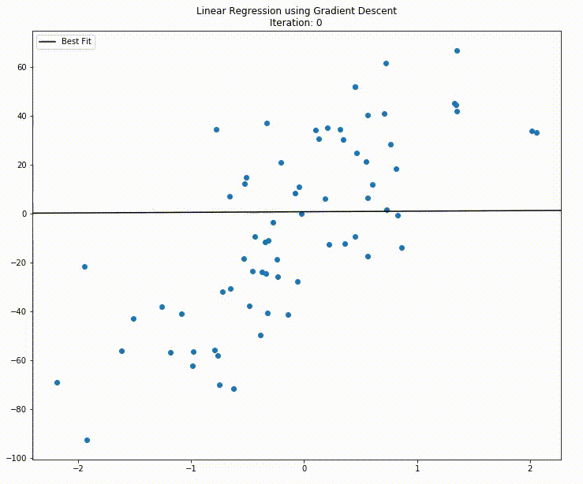
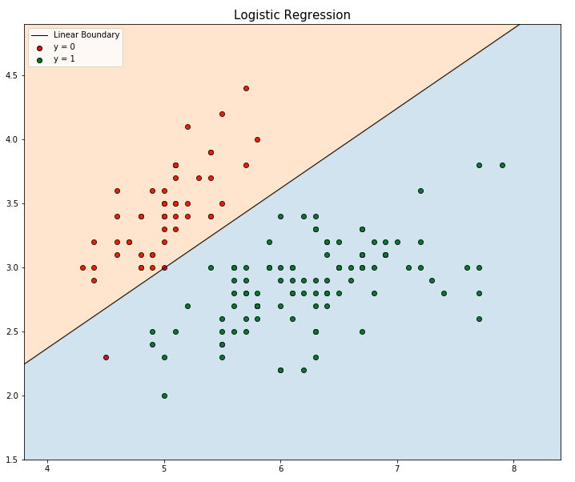
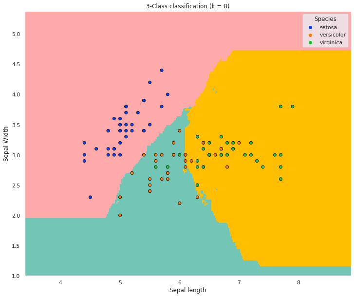
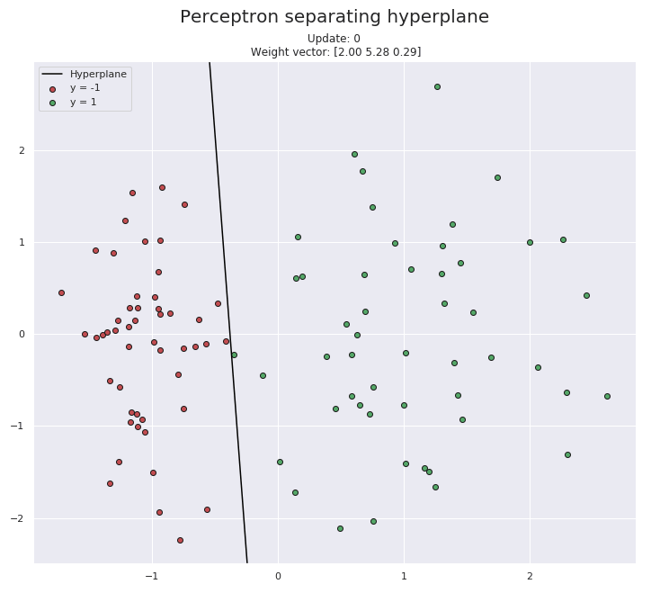
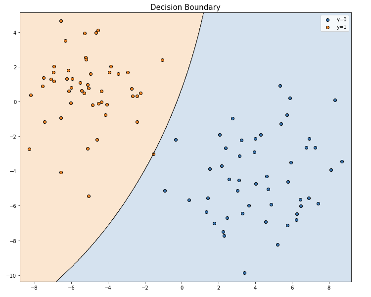
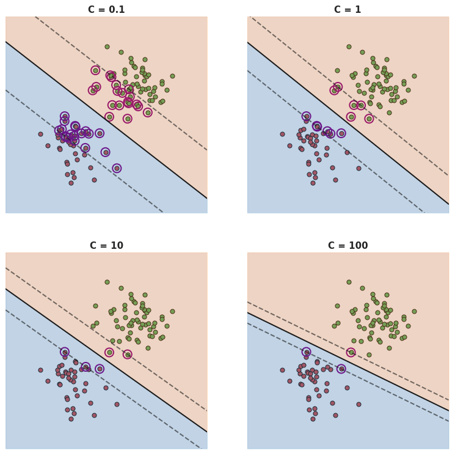

# ML-Basics
ML algorithms mostly from scratch to strengthen my understanding of concepts.

Notes + Implementation (code) of ML concepts learned from Dr. Kilian Weinberger and others from books and the web.

Github notebook viewer is not always too kind with math equations, so it is best viewed with an alternative notebook viewer, like [nbviewer](https://nbviewer.jupyter.org/).

## Topics Covered thus far
### Linear Regression

 

### Logistic Regression

 

### K-nearest neighbors

 

### Perceptron

 

### Naive Bayes

 

### Support Vector Machines

 

 
